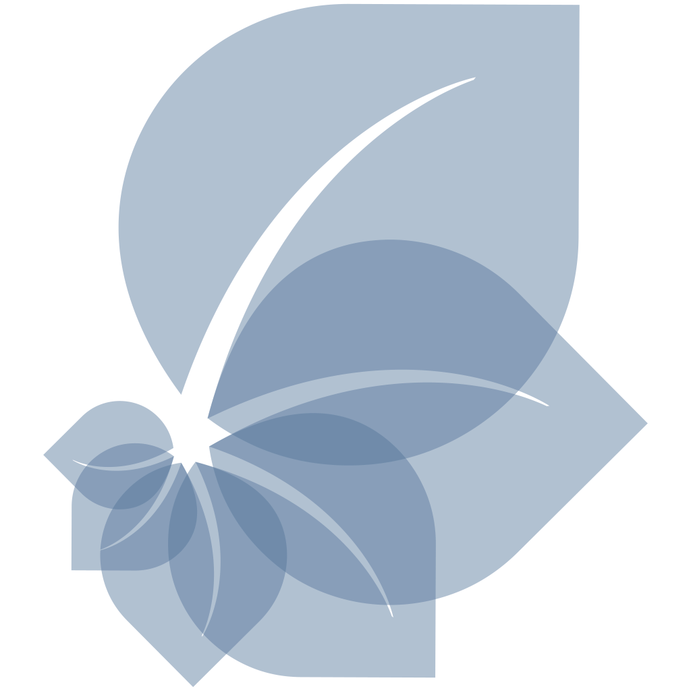

# NaturaList

_The flexible taxonomic checklist and biodiversity data platform, free and open source_

[[Website](https://naturalist.netlify.app/)] [[Demo (older v2)](https://naturalist.netlify.app/demo/)] [[Documentation (older v2, docs for v3 underway)](https://naturalist.netlify.app/)]

Paper: [Ramík, D.M., Plunkett, G.M. <b>NaturaList, a flexible app for creating taxonomic checklists</b>. Brittonia 76, 183–188 (2024)](https://link.springer.com/article/10.1007/s12228-024-09805-y)

▶️ [Watch Naturalist v3 features vide on YouTube](https://youtu.be/qxJAtrlJO8I)

▶️ [New taxonomic key functionality in v3](https://youtu.be/SamwqQMQyG8)

## About

**NaturaList** is a taxonomic checklist and biodiversity data platform app for publishing, exploring, and analysing biodiversity data. It supports both formal scientific and indigenous/folk taxonomies, handles everything from simple species lists to fully annotated specimen catalogues, and comes with powerful filtering, search, and data visualisation tools.

**NaturaList** doesn't come with a pre-defined structure you would have to fit your project into. Your taxonomy, your data fields, and the way they are displayed are all defined in a single spreadsheet - making it easy to set up, update, or extend your checklist without any IT expertise or complex software. Individual occurrence or specimen records can be attached to taxa, turning the app into a lightweight collection management tool where species-level and occurrence/specimen-level data coexist and can be explored independently.

Beyond browsing the taxonomic tree, NaturaList lets you and your users explore the data through several analytical lenses: a bubble chart of taxonomic composition, a trait matrix for comparing attributes across taxa, a regional distribution map, and built-in identification keys that narrow the checklist in real time as choices are made.

NaturaList is a progressive web app - it works in any browser and can be installed on any device (phone, tablet, laptop) to work fully offline, making it as useful in a remote field site as at a desk.

## Quick start

- Download the [latest release](https://github.com/dominik-ramik/naturalist/releases/latest) and upload it into a webhosting of your choice. Static webhosting (like [Netlify](https://netlify.com)) is enough but HTTPS needs to be enabled for the app to work offline. 
- This will give you an empty instance of the app, which you will need to fill with your data.
- Open the web address on which you installed the app. You will see a message saying you need to upload some data first. Download the blank spreadsheet which you can use to bootstrap your project.
- Fill the spreadsheet with your data. Read the documentation to learn more about different parts of the spreasheet you can configure and for a sample spreadsheet with a fully developed project to explore.
- Once done, upload your spreadsheet through NaturaList. Now whoever visits your NaturaList app address will see your checklist data appearing.
- If you want to update your checklist later on, simply make the necessary edits in your spreadsheet. Then open your NaturaList app, head to the menu and click on 'Manage'. Then upload your spreadsheet to publish the update.

## Who uses it

### Flora of Vanuatu
- Plunkett, G.M., T.R. Ranker, C. Sam, M.J. Balick, and D.M. Ramík. 2022. Vanuatu's Plant List: An Interactive Checklist of the Vascular Plants of Vanuatu.
- [checklist.pvnh.net](https://checklist.pvnh.net/)

### Plants & Fungi of Niue
- Heenan PB. 2024. Plants & Fungi of Niue NaturaList: An Interactive Checklist of the Vascular Plants and Fungi of Niue.
- [plantsniue.nu](https://plantsniue.nu/)

## Licence
NaturaList is available under [Creative Commons BY-NC-SA licence](http://creativecommons.org/licenses/by-nc-sa/4.0/).

## Author
NaturaList has been created by [Dominik M. Ramík](http://dominicweb.eu/). It has been has been originally developed for the [Checklist of the vascular flora of Vanuatu](https://pvnh.net/) under the Plants mo [Pipol blong Vanuatu](https://pvnh.net/plants-and-people-of-vanuatu/) (Plants and People of Vanuatu) research project.
